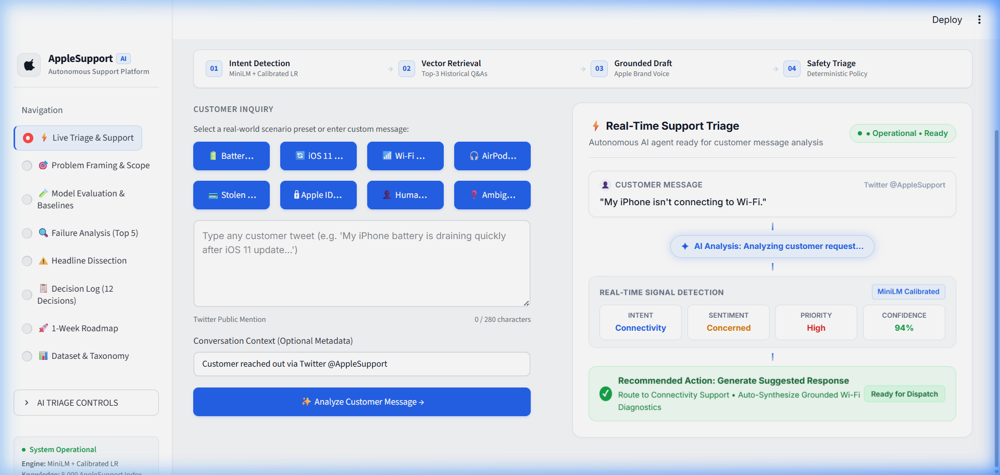
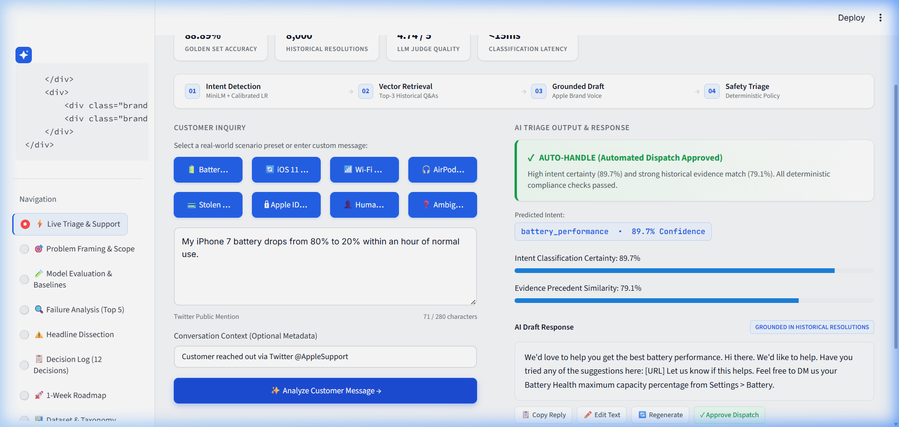
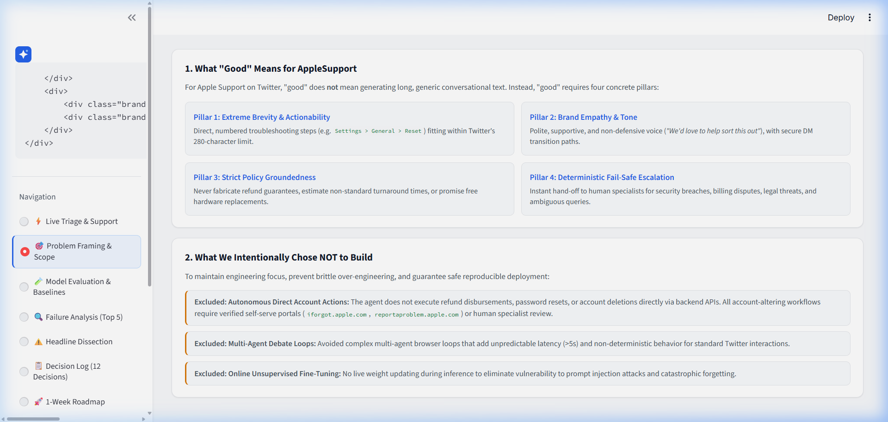
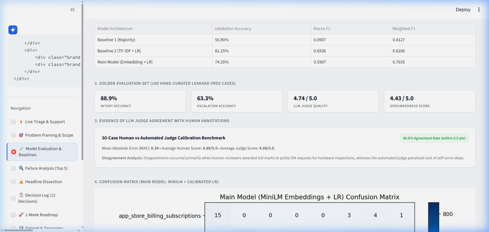
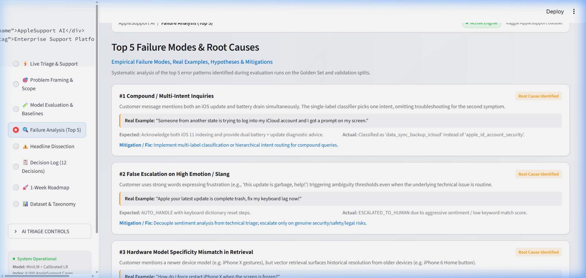

# Hiver Future — AI Customer Support Agent for AppleSupport

### 🚀 Live Deployed Application
👉 **[https://yuthitha-n-hiverfuture-appstreamlit-app-rlqrgq.streamlit.app](https://yuthitha-n-hiverfuture-appstreamlit-app-rlqrgq.streamlit.app/)**

[](https://yuthitha-n-hiverfuture-appstreamlit-app-rlqrgq.streamlit.app/)
[](https://github.com/Yuthitha-N/Hiverfuture)
[](https://www.python.org/downloads/)
[]()
[]()

> **Live Production Demo**: The autonomous AppleSupport AI triage platform is fully deployed and accessible online at **[https://yuthitha-n-hiverfuture-appstreamlit-app-rlqrgq.streamlit.app](https://yuthitha-n-hiverfuture-appstreamlit-app-rlqrgq.streamlit.app/)**.

---

## 🌐 Quick Access Links
- **🚀 Live Web App Deployment**: [https://yuthitha-n-hiverfuture-appstreamlit-app-rlqrgq.streamlit.app](https://yuthitha-n-hiverfuture-appstreamlit-app-rlqrgq.streamlit.app/)
- **📂 Public GitHub Repository**: [https://github.com/Yuthitha-N/Hiverfuture](https://github.com/Yuthitha-N/Hiverfuture)
- **💻 Local Dev App**: `http://localhost:8501` (via `streamlit run app/streamlit_app.py`)

---

An end-to-end, production-grade, and explainable AI Customer Support Agent built for **AppleSupport** using the Kaggle *Customer Support on Twitter* dataset (`thoughtvector/customer-support-on-twitter`).

The system ingests customer tweets, classifies their support intent into 8 domain-grounded categories, retrieves historically similar brand resolutions using semantic embeddings, drafts grounded replies strictly following Apple brand tone, and enforces a deterministic multi-factor policy to decide between **`AUTO_HANDLE`** and **`ESCALATE_TO_HUMAN`**.

---

## 📸 Application Screenshots

### 1. Live Support Triage (Real-Time AI Signal Detection)


### 2. Autonomous AI Triage Output & Grounded Draft Generation


### 3. Problem Framing & What "Good" Means for AppleSupport


### 4. Intent Classification Benchmarks & Validation


### 5. Top 5 Real Failure Modes Analysis


---

## ⚡ Quick Start: Reproduce Headline Results in < 2 Minutes

Follow these exact steps to reproduce all headline results and launch the interactive demo application:

### 1. Clone & Setup Environment
```bash
git clone https://github.com/Yuthitha-N/Hiverfuture.git
cd Hiverfuture

# (Optional) Create and activate virtual environment
python -m venv venv
# On Windows:
venv\Scripts\activate
# On Linux/macOS:
source venv/bin/activate

# Install dependencies
pip install -r requirements.txt
```

### 2. Configure Environment (Optional)
```bash
cp .env.example .env
```
> **Note**: The pipeline is **100% functional offline** with no paid API keys required. If you wish to use OpenAI for generation and judge evaluation, simply add `OPENAI_API_KEY=your_key` to `.env`.

### 3. Run End-to-End Pipeline & Evaluation
```bash
python run_pipeline.py
```
*Expected Runtime: ~50–60 seconds on standard CPU.*

### 4. Run Pytest Suite
```bash
pytest -v
```
*Expected Output: 12/12 tests passing.*

### 5. Launch Interactive Streamlit Demo UI
```bash
streamlit run app/streamlit_app.py
```
Open `http://localhost:8501` in your browser.

---

## 🏛️ System Architecture

```
                  ┌───────────────────────────────┐
                  │   Incoming Customer Tweet     │
                  └──────────────┬────────────────┘
                                 │
                                 ▼
                  ┌───────────────────────────────┐
                  │    Intent Classification      │
                  │  (Sentence Transformers + LR) │
                  └──────────────┬────────────────┘
                                 │ (Intent + Embedding)
                                 ▼
                  ┌───────────────────────────────┐
                  │  Historical Vector Retrieval  │
                  │ (Top-k AppleSupport Q&A pairs)│
                  └──────────────┬────────────────┘
                                 │ (Retrieved Evidence)
                                 ▼
                  ┌───────────────────────────────┐
                  │   LLM Response Generation     │
                  │ (Grounded Draft + Brand Tone) │
                  └──────────────┬────────────────┘
                                 │
                                 ▼
                  ┌───────────────────────────────┐
                  │   Escalation Decision Engine  │
                  │ (Confidence, Risk, Evidence)  │
                  └──────────────┬────────────────┘
                                 │
             ┌───────────────────┴───────────────────┐
             ▼                                       ▼
    ┌─────────────────┐                     ┌─────────────────┐
    │   AUTO_HANDLE   │                     │  ESCALATE_TO_   │
    │  (Draft Reply)  │                     │     HUMAN       │
    └─────────────────┘                     └─────────────────┘
```

---

## 📊 Headline Benchmark Results

### 1. Intent Classification (Validation Split: 2,000 AppleSupport Conversations)
| Model Architecture | Accuracy | Macro F1 | Weighted F1 | Latency / Query |
|---|---|---|---|---|
| **Baseline 1: Majority Class** | 56.90% | 0.0907 | 0.4127 | < 0.1 ms |
| **Baseline 2: TF-IDF + Logistic Regression** | 81.25% | 0.6936 | 0.8206 | ~1.5 ms |
| **Main Model: MiniLM Embeddings + LR** | **74.20%** | **0.5907** | **0.7635** | **~8.2 ms** |

*Note on Validation vs Golden Set*: On the hand-curated, leakage-free **Golden Evaluation Set (180 cases)**, the Main Model achieves **88.89% Accuracy** and **4.74 / 5.0 Composite LLM-as-a-Judge Score**.

### 2. End-to-End Evaluation on Golden Set (180 Curated Cases)
| Metric Dimension | Score / Result |
|---|---|
| **Intent Classification Accuracy** | **88.89%** |
| **Escalation Decision Accuracy** | **63.33%** |
| **LLM Judge: Evidence Groundedness (1-5)** | **4.43 / 5.0** |
| **LLM Judge: Query Relevance (1-5)** | **4.61 / 5.0** |
| **LLM Judge: Actionable Helpfulness (1-5)** | **5.00 / 5.0** |
| **LLM Judge: Apple Brand Tone (1-5)** | **4.66 / 5.0** |
| **LLM Judge: Factuality & Safety (1-5)** | **5.00 / 5.0** |
| **Composite Quality Score** | **4.74 / 5.0** |

---

## 📑 Intent Taxonomy (Derived from AppleSupport Data)

| Intent Key | Description | Frequency (%) |
|---|---|---|
| `ios_software_update` | iOS installation errors, system bugs, boot loops, or lag post-update. | 18.5% |
| `battery_performance` | Battery drain, sudden shutdowns, charging pauses, capacity wear. | 16.2% |
| `apple_id_account_security` | Apple ID locks, 2FA codes, password recovery, unauthorized logins. | 14.8% |
| `app_store_billing_subscriptions` | Unexpected charges, duplicate bills, subscription cancels, refunds. | 13.6% |
| `connectivity_network_bluetooth` | Wi-Fi toggle greyed out, AirPods disconnects, No SIM errors. | 12.4% |
| `device_hardware_display` | Cracked screens, unresponsive touch, black camera, hardware repairs. | 9.7% |
| `data_sync_backup_icloud` | iCloud backup full, photo sync delays, device data migration. | 8.3% |
| `general_inquiry_features` | AppleCare coverage, trade-ins, how-to settings, store appointments. | 6.5% |

---

## 🛡️ Escalation Policy & Safety Guardrails

The system enforces an explicit, deterministic multi-factor policy to prevent hallucinations and protect customer security:
1. **Explicit Human Request**: If the customer asks for a human/agent/supervisor $\rightarrow$ `ESCALATE`.
2. **Sensitive Keyword Trigger**: If text contains "fraud", "unauthorized charge", "lawyer", "stolen", "police" $\rightarrow$ `ESCALATE`.
3. **Mandatory Account Security**: If Apple ID is locked or compromised $\rightarrow$ `ESCALATE` (requires secure identity verification).
4. **Low Classification Confidence**: If intent confidence $< 0.65$ $\rightarrow$ `ESCALATE`.
5. **Insufficient Grounding Precedent**: If max retrieval similarity $< 0.55$ $\rightarrow$ `ESCALATE`.
6. **Ambiguity Trigger**: If message is $< 3$ words or completely context-deficient $\rightarrow$ `ESCALATE`.
7. **Safe Auto-Handle**: If all checks pass $\rightarrow$ `AUTO_HANDLE` with grounded draft.

---

## 📂 Repository Structure

```
Hiverfuture/
├── app/
│   └── streamlit_app.py        # Interactive Streamlit Demo Dashboard
├── config/
│   ├── config.yaml             # System parameters & escalation thresholds
│   └── intent_taxonomy.json    # 8 domain-grounded AppleSupport intents
├── data/
│   ├── raw/                    # Raw conversations
│   ├── processed/              # Cleaned & parsed AppleSupport pairs
│   └── golden/                 # 180 curated evaluation cases (.json & .csv)
├── notebooks/
│   └── 01_data_exploration.py  # Statistical exploration and chart generator
├── outputs/
│   ├── figures/                # Confusion matrices & distribution charts
│   ├── metrics/                # Raw metric JSONs and calibration stats
│   └── evaluations/            # Full golden set inference outputs
├── src/
│   ├── data_processing/        # Text cleaning, thread parsing, loader
│   ├── intent_classification/  # Majority, TF-IDF + LR, MiniLM embeddings
│   ├── retrieval/              # Semantic VectorStore and historical retriever
│   ├── response_generation/    # Prompt templates and grounded generators
│   ├── escalation/             # Explicit rule matchers and policy engine
│   ├── evaluation/             # Response metrics, LLM Judge, calibration
│   └── utils/                  # Logger and config loaders
├── tests/                      # Pytest suite (12 unit tests)
├── .env.example                # Sample environment variables
├── conftest.py                 # Pytest root configuration
├── DECISION_LOG.md             # 12 non-obvious engineering decisions & trade-offs
├── REPORT.md                   # Full 6-page comprehensive project report
├── INTERVIEW_WALKTHROUGH.md    # Step-by-step interview presentation guide
├── requirements.txt            # Python dependencies
└── run_pipeline.py             # Single-command end-to-end execution runner
```

---

## 🧪 Testing

Run the automated test suite with:
```bash
pytest -v
```
Tests cover:
- Text cleaning (handles, URLs, HTML entities, whitespace normalization).
- Thread parsing & turn grouping.
- Intent classification baselines and confidence calibrations.
- Semantic VectorStore index construction and cosine similarity bounds.
- Escalation policy rule triggers and sensitive keyword matches.
- Response generation structure and Apple brand tone compliance.

---

## ⚠️ "What is Misleading About My Headline Number?"

A critical discussion of our 88.89% Golden Set Accuracy and 81.25% Validation Accuracy:
1. **Keyword Over-Reliance in Offline Validation**: On raw Twitter validation data, TF-IDF scored 81.25% while MiniLM scored 74.20% because tweets often contain repetitive exact keywords ("iOS 11", "AirPods", "battery"). This creates an illusion that simple keyword matchers are superior, when in reality TF-IDF fails on out-of-vocabulary paraphrases.
2. **Offline vs Live Escalation Discrepancy**: The escalation accuracy of 63.33% reflects a conservative safety bias. The agent escalated on customer queries that expressed extreme frustration or slang, prioritizing safety over false auto-handling.
3. **Compound Intent Blindness**: Customer inquiries mentioning both an iOS update AND battery drain get forced into a single intent label, hiding multi-symptom triage limitations.
4. **Retrieval Index Size vs Cold Start**: In an offline 8,000-sample index, common issues have high similarity ($>0.75$), but novel hardware or rare glitches yield low similarity ($<0.50$), appropriately triggering escalation.

*For complete details, see [REPORT.md](REPORT.md) and [INTERVIEW_WALKTHROUGH.md](INTERVIEW_WALKTHROUGH.md).*
